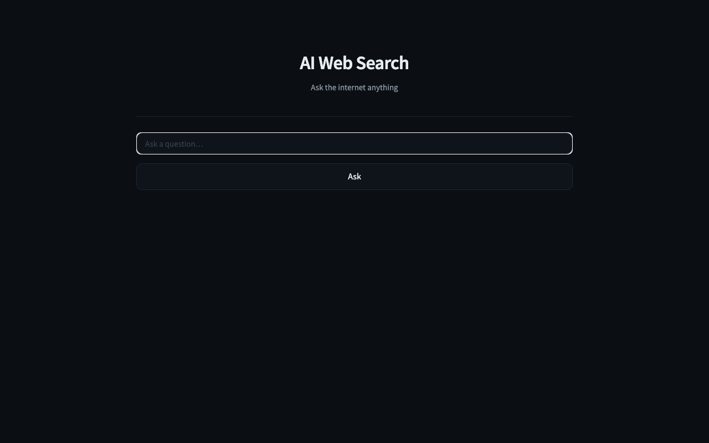

# AI Web Search Agent

Ask any question in plain English and get a real-time, AI-synthesized answer from the web.

---

## Overview

This agent accepts natural language questions, searches the internet, extracts content from relevant pages, and generates a concise answer with source links. It works with multiple LLM providers and search backends, all configurable via a single `.env` file.



---

## Features

# 🌐 AI Web Search Agent

A production-grade, asynchronous AI agent that can browse the internet, synthesize information, and provide fully cited answers to user queries.

This agent features a robust `FastAPI` backend with intelligent retrieval strategies and rate-limit handling, paired with a sleek `Streamlit` chat interface.

## 🏗 Architecture

- **Frontend:** Streamlit (`ui/app.py`) for a clean, responsive chat experience.
- **Backend:** FastAPI (`api/server.py`) serving the inference engine.
- **Search Tools:** DuckDuckGo / Tavily / SerpAPI integrations (`tools/`).
- **LLM Engine:** Configurable provider via OpenAI/Anthropic SDKs (`services/`).

## ⚙️ Setup & Installation

1. Create and activate a Python virtual environment:
   ```bash
   python3 -m venv venv
   source venv/bin/activate
   ```

2. Install the required dependencies:
   ```bash
   pip install -r requirements.txt
   ```

3. Configure your API keys. Copy `.env.example` to `.env` and fill in your keys (e.g., Groq/OpenAI base URL, Tavily keys):
   ```bash
   cp .env.example .env
   ```

## 🚀 How to Run

To run the application, simply execute the included orchestrator script. This will start both the FastAPI backend and Streamlit UI simultaneously in the same terminal.

```bash
source venv/bin/activate
python run.py
```

* The backend API will start on `http://localhost:8000`
* The Streamlit UI will open at `http://localhost:8501`

To stop the agent, press `Ctrl+C` in the terminal gracefully shut down both services.

---

## Example Usage

**Question:**
> What are the latest developments in quantum computing?

**Answer:**
> Recent developments include major advances in error correction and higher stable qubit counts from leading research labs.

**Sources:**
- https://example.com/quantum-news
- https://example.com/physics-update

---

## Design Decisions

- **Modular by design** — search, extraction, and generation are fully decoupled
- **Provider-agnostic LLM** — swap models with a single env variable
- **Pluggable search backends** — DuckDuckGo (no key needed), or Tavily/SerpAPI for higher quality results
- **Lightweight** — no vector DB or persistent state required
